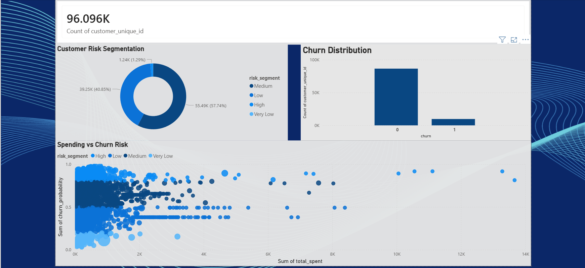

# 🛒 ChurnSense: E-commerce Customer Retention System

An end-to-end data science system that predicts customer churn, segments users by risk, and validates retention strategies using machine learning, Power BI dashboards, and A/B testing.

---

## 📌 Overview

Customer churn is a critical problem in e-commerce. This project builds a complete pipeline to:

* Analyze customer behavior
* Predict churn probability
* Segment customers into risk groups
* Design and validate retention strategies

---

## 🎯 Problem Statement

Businesses lose revenue when customers stop engaging. The goal is to:

* Identify customers likely to churn
* Understand key behavioral drivers
* Enable targeted retention strategies

---

## 🧠 Approach

### 🔹 Data Processing

* Combined multiple datasets (customers, orders, payments, products)
* Created a unified customer-level dataset

---

### 🔹 Feature Engineering

Built behavioral features such as:

* Total orders
* Total spending
* Customer lifetime
* Orders per month
* Spending rate

---

### 🔹 Modeling

* Baseline: Logistic Regression
* Improved: XGBoost

**Outcome:**

* Improved performance beyond baseline
* Captured non-linear customer behavior patterns

---

### 🔹 Customer Segmentation

Customers categorized into:

* Very Low Risk
* Low Risk
* Medium Risk
* High Risk

👉 Enables prioritization of retention efforts

---

### 🔹 A/B Testing

* Simulated retention strategy
* Targeted high-risk users
* Validated using statistical testing

**Result:**
Statistically significant improvement (p < 0.05)

---

## 📊 Power BI Dashboard

An interactive dashboard was created to visualize:

* Customer risk segmentation
* Churn distribution
* Spending vs churn risk
* Key business KPIs

### 📸 Dashboard Preview




---

## 📊 Key Insights

* Majority of customers fall into the **medium-risk segment**
* Customer engagement (orders & spending) is a strong churn driver
* High-value customers with high churn probability are key targets
* Data-driven experimentation is essential for validating strategies

---

## 🛠️ Tech Stack

* Python (Pandas, NumPy)
* Scikit-learn
* XGBoost
* Power BI
* Jupyter Notebook

---

## 📁 Project Structure

```id="2bn9c3"
ecommerce-ds-system/
│
├── data/
│   ├── raw/
│   └── processed/
│
├── notebooks/
│   └── 01_eda.ipynb
│
├── src/
│   ├── data/
│   ├── features/
│   ├── models/
│   ├── experiments/
│   └── business/
│
├── reports/
│   ├── powerbi_dashboard.pbix
│   └── dashboard_screenshot.png
├── requirements.txt
├── main.py
└── README.md
```

---

## 🚀 How to Run

### 1. Clone the repository

```bash id="2wy1a7"
git clone <https://github.com/navonilmandal/ChurnSense-E-commerce-Customer-Retention-System>
cd ecommerce-ds-system
```

### 2. Install dependencies

```bash id="y7qg9x"
pip install -r requirements.txt
```

### 3. Run pipeline

```bash id="s0u7a1"
python main.py
```

---

## 💡 Future Improvements

* Deploy model as API
* Real-time prediction system
* Advanced feature engineering
* Hyperparameter tuning
* Integration with live data

---

## 🧾 Conclusion

This project demonstrates how machine learning, business intelligence, and experimentation can be combined to solve real-world problems like customer churn. It emphasizes not only prediction but also actionable insights and validation.

---

## 👤 Author

Navonil Mandal
